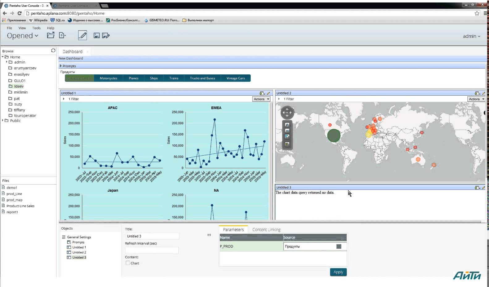

:auto-console: true
:skip-help: true
:css: css/slides.css

.. title:: Reporting Databases

----

Reporting Databases
===================

Lennart Regebro

.. image:: images/shoobx.png
   :class: logo

Wroc.py 2016-09-06

----

.. image:: images/shoobx.png
   :class: logo

.. image:: images/shoobx.jpg
   :width: 100%

.. note::

   Shoobx is the one place where entrepreneurs, lawyers, investors, and board
   members can come together to generate, review, approve, and execute
   company documents. Shoobx is a system of record, execution, and engagement
   built to simplify standard corporate legal processes so entrepreneurs can
   focus on what matters most: their company.

   It's basically a webapp for simplifying the handling of legal documents.

----

.. image:: images/diag-godb-er.jpg
    :width: 100%

.. note::

   So you have a big database, right, and the database is extremely
   normalized, because it was designed by people who had taken university
   courses in relational databases, so this means that no data is duplicated
   anywhere, which gives you a lot of tables, and means you have to make many,
   many joins. Everytime you make a query.

   And you want to make reports. Many reports. Which office is selling most
   of the yellow telephones? How has shipping costs developed the last few
   years? Are we actually getting new customers in a rate higher than we lose
   old ones? The economics department has many questions.

----

.. image:: images/keyvalue.png
   :width: 100%

.. note::

   Or, your data is stored in a NoSQL database. There are index objects,
   but not on the things you need to index on. And there is no reporting
   tool that will make nice reports based on your brand of obscure NoSQL
   database that you choose when this project started because it was the
   hyped database of the week.

   Or, worst case, your data may be spread over many databases, maybe even
   several different types of datatabases!

----

.. image:: images/report-writing.jpg
   :width: 100%

.. note::

   So you make the reports. For the SQL database you end up writing these
   elaborate queries with loads of JOIN statements, and you make a nice table
   or a nice graph out of it.

   For the NoSQL database you actually have to write a program that exports the
   correct data into a CSV file that you then can make reports from. Maybe you
   have to merge the data from different databases.

   All is well. Your boss is happy. Your job is secure!

----

.. image:: images/job-search-frustration-ftr.jpg
   :width: 100%

.. note::

   And the next Tuesday there is a slight change in one of the database schemas,
   and your carefully crafted queries or Python code needs changing.
   But your boss wants THIS weeks report.

   And in fact, she likes your reports so much, that she demands daily copies!
   But because of the complicated database schema, or lack of indexes your
   reports take hours to run, and whenever you do run them, the database slows
   down and everybody stars complaining that the Internet is slow, because they
   have no idea what is the Internet and what is not, and they go to the
   network admin and he figures out it's the database that is overloaded and
   gets angry at you and takes up your time when you need to fix the reports.

----

You need a reporting database!
==============================

.. note::

   Databases are designed to be fast and useful for the software that uses it.
   So you have indexes on last name and first name because that's what
   people use to find the customer they are talking to. They don't index
   which region of Poland the customer belongs to, because nobody ever searches
   for that. Except you, as you make a report with sales per region.

----

What?
=====

* Made to do reporting easy

* Read-only

* Not afraid of duplicating data

* Can be run on a separate server

* Should be rebuildable from production server data

* Can integrate data from several sources

* You can have multiple reporting databases

----

When?
=====

* When transaction performance is critical

* If you have multiple databases

* If the reports are long running

* If you need to do "massage" the data

.. note::

   * When transaction performance is critical, so you don't want to add indexes
     tables or fields to support reporting.

   * If you have multiple databases that has data you need for the reports.

   * If the reports are long running.

   * If you need to do "massage" the data before reports. For example, internal
     field names and value might not fit what the economics department expects,
     or you have different company regions than the database, etc.

----

How?
====

* Separate database, maybe even separate server

* Use a star or snowflake schema

* Update the reporting database asynchronously

* Data should be rebuildable from production servers

----

Star schemas
============

.. image:: images/starschema2.gif

.. note::

   Star schemas are simple schemas where relations are only between the central
   "fact" table and the surrounding "dimension" tables.

   In theory the fact table should hold the measurable, quantitative data
   about a business, and dimensions which are descriptive attributes
   related to fact data, so for example, a fact table could contain a list
   of all sales transactions, while the dimension tables hold the information
   about the things sold, the customers, etc.

----

.. image:: images/Star-schema-example.png
   :width: 100%

.. note::

   In practice is tends to be hard to know what is a fact and what is a
   dimension. With a reporting database, always design it so that reports
   become easy and reasonable.

   The important part in a star schema is that you don't have relations between
   the dimensions, because then queries can become complicated again.

----

.. image:: images/Snowflake-schema.png
   :width: 100%

.. note::

   What you can have is that you can add another level of dimensions, this
   is then called a snowflake schema. I don't know how often it's needed, but
   you should generally try to avoid it, because you end up with similar
   issues as a normalized production database.

----

The Date Dimension
==================

================== =============== == ================== ===============
 **Column**         **Value**          **Column**         **Value**
================== =============== == ================== ===============
 id                 20160906           weekday            2
 date               <2016-09-06>       weekday_name       'Tuesday'
 day                6                  weekday_abbr       'Tue'
 day_ordinal        '6th'              is_weekend         False
 month              9                  dow_in_month       1
 month_name         'September'        day_of_year        250
 month_abbr         'Sep'              week_of_month      2
 month_of_quarter   3                  week_of_year       36
 quarter            3                  iso_week_of_year   36
 quarter_ordinal    3rd                mmyyyy             '092016'
 month_year         '09-1026'          is_holiday         False
 year               2016               holiday_name       ''
 year_name          'CY 2016'
================== =============== == ================== ===============

.. note::

   Date calculations are tricky and can take time, and what is worse, it's
   not possible to make queries on them. So therefore, one of the dimension
   tables is a prefilled date dimension where all the calculations have
   been done already, so you can query it.

   This way you can make a query that filters only Tuesdays the 6th, in the
   second quarter, or whatever.

   What columns you want is up to you, these are the ones from the database
   we are using, which is complete overkill.

----

Extract, Transform, Load
========================

.. note::

   The basic procedure for updating the reporting database, or any kind of
   data warehouse is called ETL, extract, transform, load.

   It sounds obvious, but it isn't, because there is also ELT, extract, load,
   transform, where the transformation of data is done when actually looking
   at data. But as we want the reporting database to be easy to use for
   reports, we need to transform the data before loading it into the reporting
   database.

   These three steps doesn't need to be done at the same place or the same
   time. And where to do them and how depends a lot on how your choose to
   update the reporting database.

----

Updating the reporting db
=========================

* In-application updating

* Client/Server

* Separate process

.. note::

   And how you update the reporting database depends a lot on how your
   application looks. Is it a commercial third-party application that you
   can't modify? Then it pretty much needs to be a separate process. Do you have
   multiple apps that you need to merge the data from? Again, it pretty much
   has to be a separate process.

----

In-application updating
=======================

* Requires application modification

* Risk inconsistent data

* App must change when reporting db changes

* No long running main database usage

* You need async support

.. note::

   If you are developing the application that uses the main database, you could
   in theory just add updating of the reporting database directly from that
   application. To not make the application slower as a result you need to
   do the updates asynchronously, with Celery, gevent or similar.

   And you will have to make sure the reporting database is updated everywhere
   the main database is updated. This is easier to do if the application is
   event driven, so that modifying an object always raises an event, because
   then you can trap that event and do the update.

   I would not attempt this without using events that are emitted by the
   framework or library being used, because otherwise you will forget, and
   your data will be inconsistent.

----

Client/Server
=============

* Requires application modification

* Risk inconsistent data

* Clean separation of ETL responsabilities

* No long running main database usage

.. note::

   Async tasks mean: multiprocessing, Celery, or gevent etc

   This again requires you to modify the application server, and you need to
   have a good event framework. But you get better separation of
   responsabilities and the app only needs updating if the server API changes.

----

Separate process
================

* No application modifications

* Can run on separate server instance

* Can bog down database server

* Monitoring may be tricky

* Ready made tools exist!

.. note:

   For these last two, there are tools and frameworks that can help you.
   Pentaho for example has a data integration tool called "Kettle" where
   you can define up the Extractions, Transformations and Load them into
   a database. And you can decide when these should be run, including saying
   that it should be run every 15 minutes etc.

   Here again Pentaho has a solution, it's called "Kettle" and is a data
   integration server, where you define up the Extract/Transform/Load jobs,
   and when they should be run. I haven't used it, using it for us would be
   hard.

----

Change Data Capture
===================

 * Time stamps

 * Sequenced IDs

 * Database triggers/events

 * Database logs

.. note::

   If you don't have that much data you might be able to sync all the data in
   a nightly batch job. But that doesn't work for services that must run
   24/7, because it can put a heavy load on the databases. You might also
   want more immediate data.

   In that case you must be able to detect changes. There's various ways of
   doing that.

   Remember, that no matter what solution you choose, you need to also have
   a process in place to sync *all* data, for when you need to modify the
   reporting database schema.

----

Reporting tools
===============

.. note::

   I don't think any of the reporting tools available for free is very good.
   Most are not usable by a normal end user. You typically need to be able to
   write your own SQL queries.

----

Libreoffice Base
================

.. image:: images/libreofficebase.png
   :width: 700px

.. note::

   Libreoffice Base is the only open source tool that is aimed at normal
   mortals. It has some really nice features like this query editor where
   you can make queries without writing SQL!

   The reports are made in Libreoffice Writer, and is by default horribly
   ugly. I could not figure out how to insert a chart, but it seems like it's
   possible to do.

   A power user could probably use this without knowing much SQL.

----

BIRT
====

.. image:: images/birt.png
   :width: 700px

.. note::

   BIRT is a plugin to Eclipse. Yes, that's a fairly strange way to write a
   GUI tool, using a code editor as base, but hey, if Emacs can...

   It's a bit hard to learn, I think and the documentation isn't very good.
   But it's usable. Default reports are a bit more sensible and not quite as
   ugly as Libreoffice, but here you have no help at all in writing SQL
   queries.

----

Pentaho Community Edition
=========================

.. image:: images/pentaho-report-designer.jpg
   :width: 700px

.. note::

   Pentaho is a collection of tools for reporting, based around a "business
   analytics" server. There you can you can publish reports and then those
   who needs them can run them. There is also data integration tools if you
   have many sources of data, etc.

   What I have used is the Pentaho Report Designer which essentially does the
   same thing as BIRT, except that you can publish the reports to the server.
   It's VERY quirky, but you get used to it.

   It has a GUI query designer, like Libreoffice, but it's nowhere near as
   good.

----

Pentaho Enterprise Edition
==========================

.. note::

   Pentaho EE has a somewhat easier to use GUI tool for making reports, but
   it's still very quirky. Also the Pentago EE is rumoured to be insanely
   expensive.

----

Libraries/Frameworks
====================

* Reportlab

* Tryton

.. note::

   Reportlab is a library to generate PDF's. You make templates in XML and
   feed it data, and out pops a report. Nice for making reports that need to
   be run with a cron job.

   Tryton is supposed to have reporting tools or libraries, but I haven't
   looked at it, but it's worth mentioning.

----

How we do this on Shoobx
========================

* Only one source for data

* Main app is written by us

* We already had support for events and Celery

.. note::

   We have it reasonably easy, as we only have one source of data.
   We use several different databases, but we only have one application.
   It's also an application we write ourselves, with an event framework
   and Celery.

----

The Reporting Server
====================

* Flask

* Sqlalchemy + PostgreSQL

* REST API

.. note::

   We wanted to separate the reporting from the application as much as
   possible, so we don't even want to open the reporting database from the
   application. Instead we wrote a small REST/JSON server in Flask which
   recieves the data and puts it into the Postgres db.

----

On the application side
=======================

Events -> Celery -> Collect data -> REST call

.. note::

   Our webapp is written on Zope 3 which has an event system. So we registered
   a whole bunch of new event handlers on the modification and workflow events.

   These event handlers add Celery tasks to the queue. Those tasks are then
   picked up by the Celery handlers, which run separately from the web
   application, which gathers the data to be sent and sends it with a REST call.
   We use the requests library for that.

----

Reporting
=========

.. image:: images/report-chart.png
   :width: 100%

.. note::

   We use Pentaho, becuase of the feature that we can put reports on a
   server so the administration people can run them, themselves.

----

.. image:: images/report-table.png
   :width: 100%

.. note::

   Here is an example of how a table report looks, you can see that you
   can choose from a list of companies to run the report on.
   This demo database only has two.

----

.. image:: images/workitem_fact.png
   :width: 100%

.. note::

   The reporting database schema is quite complex. It's a star schema, with
   date dimensions. Note how each table name ends either in _fact or _dim.
   That's very useful, especially since you might need both fact tables and
   dimension tables for the same thing.

----

.. image:: images/entity_fact.png
   :width: 100%

.. note::

   Here for example we have the entity_fact table. While in the previous
   schema we had an entity_dim table. Entities in this case more or less
   means "companies", btw.

   Another notable thing is that we use the date_dim again, and also user_dim.
   This means we reuse the dimension tables between different stars. I haven't
   seen anything in the theoretical writings about star schemas that either
   allow or forbid it, but it makes sense to us, anyway.

   So the real schema is actually five different fact tables with loads of
   dimension tables around.

----

.. image:: images/schema.png
   :width: 100%

.. note::

   A bit messy. But note that several of the dimension tables have
   relations to several fact tables, but none of the dimension tables have
   relations to any other dimension table.

----

Queries
=======

.. code:: SQL

   SELECT
        "entity_dim"."title" AS Entity,
        "process_dim"."definition_title" AS Process,
        "workitem_type_dim"."title" AS Workitem_type,
        "workitem_fact"."started" AS Started,
        "user_dim"."name" AS User
   FROM
        "public"."workitem_fact" "workitem_fact"
        LEFT OUTER JOIN "public"."user_dim" "user_dim"
            ON "workitem_fact"."participant_user" = "user_dim"."id"
        INNER JOIN "public"."workitem_type_dim" "workitem_type_dim"
            ON "workitem_fact"."type" = "workitem_type_dim"."id"
        INNER JOIN "public"."entity_dim" "entity_dim"
            ON "workitem_fact"."entity" = "entity_dim"."id"
        INNER JOIN "public"."process_dim" "process_dim"
            ON "workitem_fact"."process" = "process_dim"."id"
   WHERE
        "workitem_fact"."priority" >= 0
    AND "workitem_fact"."finished" IS NULL
    AND "entity_dim"."id" = ${ENTER_ENTITY_ID}
   ORDER BY
        "entity_dim"."title" DESC,
        "process_dim"."definition_title" DESC,
        "workitem_type_dim"."title" DESC

----

Questions?
==========
