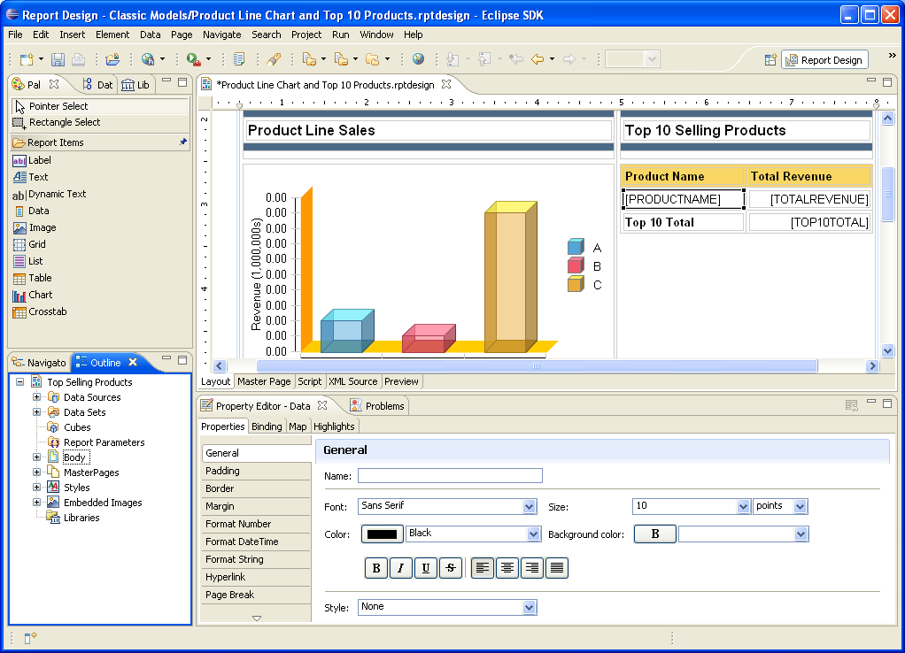

:auto-console: true
:skip-help: true
:css: css/slides.css

.. title:: Reporting Databases

----

Reporting Databases
===================

Lennart Regebro

.. image:: images/shoobx.png
   :class: logo

PyCon PL 2016-10-15

.. note::

   First something quick about the Company I work for, Shoobx.

----

.. image:: images/shoobx.png
   :class: logo

.. image:: images/shoobx.jpg
   :width: 100%

.. note::

   Shoobx is the one place where entrepreneurs, lawyers, investors, and board
   members can come together to generate, review, approve, and execute
   company documents. Shoobx is a system of record, execution, and engagement
   built to simplify standard corporate legal processes so entrepreneurs can
   focus on what matters most: their company.

   It's basically a webapp that will deal with all your legal documents.
   At Shoobx I have mostly been dealing with reporting.

----

.. image:: images/diag-godb-er.jpg
    :width: 100%

.. note::

   And you want to make reports. Many reports. Which office is selling most
   of the yellow telephones? How has shipping costs developed the last few
   years? Are we actually getting new customers in a rate higher than we lose
   old ones? People have many questions.

   So you have a big database, right, and the database is extremely
   normalized, because it was designed by people who had taken university
   courses in relational databases. So this means that no data is duplicated
   anywhere, which gives you a lot of tables many that only have a key column
   and a value column, and means you have to make many, many joins. Everytime
   you make a query. And if you make a small mistake, your query will not run
   in ten seconds, it will take 10 hours.

----

.. image:: images/keyvalue.png
   :width: 100%

.. note::

   Or, your data is stored in a NoSQL database. There are indexes,
   but not on the things you need to index on. And there is no reporting
   tool that will make nice reports based on your brand of obscure NoSQL
   database that you choose when this project started because it was the
   hyped database of the week.

   Or your data may be spread over many databases, maybe even
   several different types of databases!

----

.. image:: images/report-writing.jpg
   :width: 100%

.. note::

   But you make the reports. For the SQL database you end up writing these
   elaborate queries with loads of JOIN statements.

   For the NoSQL database you actually have to write a program that exports the
   correct data into a CSV file that you then can make reports from. Maybe you
   have to merge the data from different databases.

   You make a nice table or a nice graph out of the data. All is well. Your
   boss is happy. Your job is secure!

----

.. image:: images/job-search-frustration-ftr.jpg
   :width: 100%

.. note::

   And the next Tuesday there is a slight change in one of the database schemas,
   and your carefully crafted queries or Python code needs changing.
   But your boss wants THIS weeks report.

   And in fact, She likes your reports so much, that she demands daily copies!
   But because of the complicated database schema, or lack of indexes your
   reports take hours to run, and whenever you do run them, the database slows
   down and everybody stars complaining that the Internet is slow, because they
   have no idea what is the Internet and what is not, and they go to the
   network admin and he figures out it's the database that is overloaded and
   gets angry at you and stops bringing you coffee.

   You are in a pickle now! You need a reporting database!

----

You need a reporting database!
==============================

.. note::

   Databases are designed to be fast and useful for the software that uses it.
   So you have indexes on last name and first name because that's what
   people use to find the customer they are talking to. They don't index
   which region of Poland the customer belongs to, because nobody ever searches
   for that. Except you, as you make a report with sales per region.

----

What?
=====

* Made to do reporting easy

* Not afraid of duplicating data

* Can integrate data from several sources

* Often, but not necessarily, "read-only"

.. note::

   * Made to do reporting easy

   * Not afraid of duplicating data

   * Can integrate data from several sources

   * Often, but not necessarily, "read-only"

----

When?
=====

* When transaction performance is critical

* If you have multiple databases

* If the reports are long running

* If you need to do "massage" the data

.. note::

   * When transaction performance is critical, so you don't want to add indexes
     tables or fields to support reporting.

   * If you have multiple databases that has data you need for the reports.

   * If the reports are long running.

   * If you need to do "massage" the data before reports. For example, internal
     field names and value might not fit what the economics department expects,
     or you have different company regions than the database, etc.

----

How?
====

* Separate database

* Maybe even separate server

* Asynchronous updates

* Data must be rebuildable

* Use a star or snowflake schema

.. note::

   * Separate database

   * Maybe even separate server

   * Asynchronous updates

   * Data must be rebuildable

   * Use a star or snowflake schema

----

Star schemas
============

.. note::

   Star schemas are simple schemas where relations are only between the central
   "fact" table and the surrounding "dimension" tables.

   In theory the fact table should hold the measurable, quantitative data
   about a business, and dimensions which are descriptive attributes
   related to fact data, so for example, a fact table could contain a list
   of all sales transactions, while the dimension tables hold the information
   about the things sold, the customers, etc.

----

.. image:: images/Star-schema-example.png
   :width: 100%

.. note::

   In practice is tends to be hard to know what is a fact and what is a
   dimension. With a reporting database, always design it so that reports
   become easy and reasonable.

   The important part in a star schema is that you don't have relations between
   the dimensions, because then queries can become complicated again.

----

.. image:: images/Snowflake-schema.png
   :width: 100%

.. note::

   What you can have is that you can add another level of dimensions, this
   is then called a snowflake schema. I don't know how often it's needed, but
   you should generally try to avoid it, because you end up with similar
   issues as a normalized production database.

----

The Date Dimension
==================

================== =============== == ================== ===============
 **Column**         **Value**          **Column**         **Value**
================== =============== == ================== ===============
 id                 20160906           weekday            2
 date               <2016-09-06>       weekday_name       'Tuesday'
 day                6                  weekday_abbr       'Tue'
 day_ordinal        '6th'              is_weekend         False
 month              9                  dow_in_month       1
 month_name         'September'        day_of_year        250
 month_abbr         'Sep'              week_of_month      2
 month_of_quarter   3                  week_of_year       36
 quarter            3                  iso_week_of_year   36
 quarter_ordinal    '3rd'              mmyyyy             '092016'
 month_year         '09-1026'          is_holiday         False
 year               2016               holiday_name       ''
 year_name          'CY 2016'
================== =============== == ================== ===============

.. note::

   Date calculations are tricky and can take time, and what is worse, it's
   not possible to make queries on them. So therefore, one of the dimension
   tables is a prefilled date dimension where all the calculations have
   been done already, so you can query it.

   This way you can make a query that filters only Tuesdays the 6th, in the
   second quarter, or whatever.

   It also includes columns that are not for querying, but for displaying, such
   as the quarter_ordinal, which contains the text '3rd'.

   The Id, as you see, is an integer for fast indexing, but an integer which
   is easily recognizable for humans. So, ISO date format.

   What columns you want is up to you, these are the ones from the database
   we are using, which is complete overkill.

----

Extract, Transform, Load
========================

.. note::

   The basic procedure for updating the reporting database, or any kind of
   data warehouse is called ETL, extract, transform, load.

   It sounds obvious, but it isn't, because there is also ELT, extract, load,
   transform, where the transformation of data is done when actually looking
   at data. That's usually done for "data lakes" where you stick *all* your
   data in quite raw formats for data mining and things like that.

   But as we want the reporting database to be easy to use for reports, we
   need to transform the data before loading it into the reporting database.

   These three steps doesn't need to be done at the same place or the same
   time. And where to do them and how depends a lot on how your choose to
   update the reporting database.

----

Extract
=======

.. note::

   You can essentially extract the data in two ways, either by making a big
   batch dump from your database or databases at regular intervals, or you
   can update the reporting database when data changes.

   If you have very sensitive data, then the exptract step should be careful
   about what data is extracted. You don't want to have world readable CSV
   files with data on exactly who bought a franch tickler. It might be
   somebody who isn't a protestant!

----

Big Batch
=========

* May bog down database server

* Can run on separate server instance

* Ready made tools exist!

.. note::

   Batch extract is the most common, and preferable if you can do a dump of
   all data in a reasonable time frame. Dumping all data out to CSV files etc
   can bog down the database, so it's best to do it at night.

   A big benefit of this procedure is that most of the tools that exist have
   software specifically to extract data from databases in this way.

   If you don't have that much data you might be able to sync all the data in
   a nightly batch job. If not, you need to just sync the data that has
   changed.

----

Change Data Capture
===================

* Risk inconsistent data if data is lost or one update fails

* No long running main database usage

.. note::

   In that case you must be able to detect changes. This has drawbacks, and
   benefits.

----

Change detection
================

* Time stamps

* Sequenced IDs

* Database logs

.. note::

   There's various ways of detecting changes. You can have time stamps for
   anything that gets updates, or sequenced IDs for things that just get
   added, but never change. These typically requires you to modify the
   application, which is not always possible.

   You can also extract information on what changed from database logs on
   some databases. And other way is to define Database triggers and events
   that typically will either trigger an update, or just write information on
   what changed to a log.

   And lastly, you can use Application events to update the database.

   Remember, that no matter what solution you choose, you need to also have a
   process in place to sync *all* data, for when you need to modify the
   reporting database schema.

----

Update on Change
================

* Database triggers/events

* Application events

* Near-real-time updates

.. note::

   Now, the last two here opens the possibility to update the reporting
   database "on the fly" and not in batch jobs.

   This gives you near real-time data, but adds complexity. And the
   application event solution typically means you must be the main developers
   of the database applications.

----

Transform
=========

.. note::

   That's all for Extracting. The next step is Transform, which means you
   take the extracted data, and use it to generate the data used for the
   reports. This is sometimes easy, and sometimes hard. You might even have
   so much data that you don't want to transform in memory, meaning you first
   need to load it into temporary tables, transform, and re-export it, delete
   those tables and then load it into the real reporting database.

   But for the most case, you can use do the transform record by record.

----

Load
====

.. note::

   And if you can do it record by record, then loading it to the database is
   usually just a question of writing that record to the database directly.
   The output of the transform can very well be new comma separated files, or
   you can just load the data into the database directly from the scripts
   that do the transformation.

   So the separation between Transform and Load isn't always obvious, mainly
   because loading is trivial.

----

TADA!
=====

.. note::

   You now have a reporting database, and you can make reports. For that you
   need some sort of reporting tool.

----

Reporting tools
===============

.. note::

   I don't think any of the reporting tools available for free is very good.
   Most are not usable by a normal end user. You typically need to be able to
   write your own SQL queries.

----

Libreoffice Base
================

.. note::

   Libreoffice Base is the only open source tool that is aimed at normal
   mortals. It has some really nice features like this query editor where
   you can make queries without writing SQL!

   The reports are made in Libreoffice Writer, and is by default horribly
   ugly. I could not figure out how to insert a chart, but it seems like it's
   possible to do.

   A power user could probably use this without knowing much SQL.

----

BIRT
====

.. note::

   BIRT is a plugin to Eclipse. Yes, that's a fairly strange way to write a
   GUI tool, using a code editor as base, but hey, if Emacs can...

   It's a bit hard to learn, I think and the documentation isn't very good.
   But it's usable. Default reports are a bit more sensible and not quite as
   ugly as Libreoffice, but here you have no help at all in writing SQL
   queries.

----

Pentaho Community Edition
=========================

.. image:: images/pentaho-report-designer.jpg
   :width: 700px

.. note::

   Pentaho is a collection of tools for reporting, based around a "business
   analytics" server. There you can you can publish reports and then those
   who needs them can run them. There is also data integration tools if you
   have many sources of data, etc.

   What I have used is the Pentaho Report Designer which essentially does the
   same thing as BIRT, except that you can publish the reports to the server.
   It's VERY quirky, but you get used to it.

   It has a GUI query designer, like Libreoffice, but it's nowhere near as
   good.

----

Libraries/Frameworks
====================

* Reportlab

.. note::

   Reportlab is a library to generate PDF's. You make templates in XML and
   feed it data, and out pops a report.

   Obviously, with reportlab you need to write the report generation as
   Python scripts. This means that you can forget end users making reports
   so it's not ideal as a generic solution.

   But it's nice for making reports that need to be run with a cron job.
   Python can also do things SQL can't easily do, BUT the point of a
   reporting database is that you shouldn't need that in the first place!

----

How we do this at Shoobx
========================

* Near real-time

* Super sensitive customer data

* Reports available to run as needed

.. note::

   How do we do this at Shoobx? well, we do it the hardest way we could think
   of! We started out with very unusual requirements, and this meant our
   solution is unusual, but there's a lesson in there as well, because the fact
   is that manny of these requriements were later dropped for various reasons.

   We wanted to use the reporting database to do reports also available for
   the customer through our Web app. For example reports on who actually owns
   how many stocks in a company. That means our reporting database should
   really only be maybe 10 15 minutes out of sync in the worst case.

   This excludes most batch solutions.

   That's also very sensitive data, so we could not just have one database
   for all customers, they needed one each.

   And the non-customer reports should also be available to be run when needed
   by those internally that needed them. Obviously those reports can not
   contain very sensitive data.

----

That means
==========

* Update on change

* One database per customer

* Pentaho for the reports

----

Good infrastructure
===================

* Only one source for data

* App is written by us

* We already had events and Celery

.. note::

   So we have high requirements, but we also have an infrastructure that easily
   could accomodate those requirements, so it wasn't as bad as it sounds.

   We only have one source of data. We do use several different databases,
   but we only have one application. It's also an application we write
   ourselves, built on the Zope Component Framework, so we already had change
   events in the application, and we also already was using Celery to do
   asynchronous tasks.

   These requirements meant that we decided to do the extract on the app side
   based on modification events, but do so asynchronously with Celery, and
   have a a small RESTful server that would do the transform and load.

----

Extract
=======

Events -> Celery -> Collect data -> REST call

.. note::

   We just registered a whole bunch of new event handlers on the modification
   and workflow events.

   These event handlers add Celery tasks to the queue. Those tasks are then
   picked up by the Celery handlers, which run separately from the web
   application, which gathers the data to be sent and sends it with a REST call.

----

Transform and Load
==================

* Flask

* Sqlalchemy + PostgreSQL

* REST API

----

Reporting
=========

.. note::

   We use Pentaho, becuase of the feature that we can put reports on a
   server so the administration people can run them, themselves.

----

.. note::

   Here is an example of how a table report looks, you can see that you
   can choose from a list of companies to run the report on.
   This demo database only has two.

----

.. note::

   The reporting database schema is quite complex. It's a star schema, with
   date dimensions. Note how each table name ends either in _fact or _dim.
   That's very useful, especially since you might need both fact tables and
   dimension tables for the same thing.

----

.. image:: images/entity_fact.png
   :width: 100%

.. note::

   Here for example we have the entity_fact table. While in the previous
   schema we had an entity_dim table. Entities in this case more or less
   means "companies", btw.

   Another notable thing is that we use the date_dim again, and also user_dim.
   This means we reuse the dimension tables between different stars. I haven't
   seen anything in the theoretical writings about star schemas that either
   allow or forbid it, but it makes sense to us, anyway.

   So the real schema is actually five different fact tables with loads of
   dimension tables around.

----

.. image:: images/schema.png
   :width: 100%

.. note::

   A bit messy. But note that several of the dimension tables have
   relations to several fact tables, but none of the dimension tables have
   relations to any other dimension table.

----

Queries
=======

.. code:: SQL

   SELECT
        "entity_dim"."title" AS Entity,
        "process_dim"."definition_title" AS Process,
        "workitem_type_dim"."title" AS Workitem_type,
        "workitem_fact"."started" AS Started,
        "user_dim"."name" AS User
   FROM
        "public"."workitem_fact" "workitem_fact"
        LEFT OUTER JOIN "public"."user_dim" "user_dim"
            ON "workitem_fact"."participant_user" = "user_dim"."id"
        INNER JOIN "public"."workitem_type_dim" "workitem_type_dim"
            ON "workitem_fact"."type" = "workitem_type_dim"."id"
        INNER JOIN "public"."entity_dim" "entity_dim"
            ON "workitem_fact"."entity" = "entity_dim"."id"
        INNER JOIN "public"."process_dim" "process_dim"
            ON "workitem_fact"."process" = "process_dim"."id"
   WHERE
        "workitem_fact"."priority" >= 0
    AND "workitem_fact"."finished" IS NULL
    AND "entity_dim"."id" = ${ENTER_ENTITY_ID}
   ORDER BY
        "entity_dim"."title" DESC,
        "process_dim"."definition_title" DESC,
        "workitem_type_dim"."title" DESC

----

Some problems
=============

* How do you know if data is missing? - You don't.

* Synchronous updates slow down the app. Async updates can come in the wrong order. - timestamps

* requests library does NOT timeout by default! As a result Celery workers would get stuck.

* For speed we wanted multi-threaded server, but we got massive write conflicts! - Choose the right conflict strategy on the postgresl server.

----

Questions?
==========

http://slides.colliberty.com/PyConPL-2016

